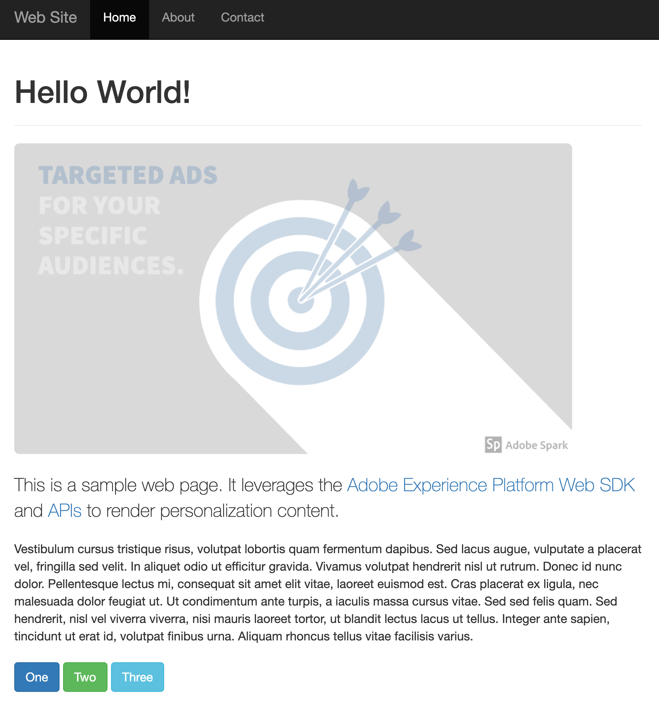
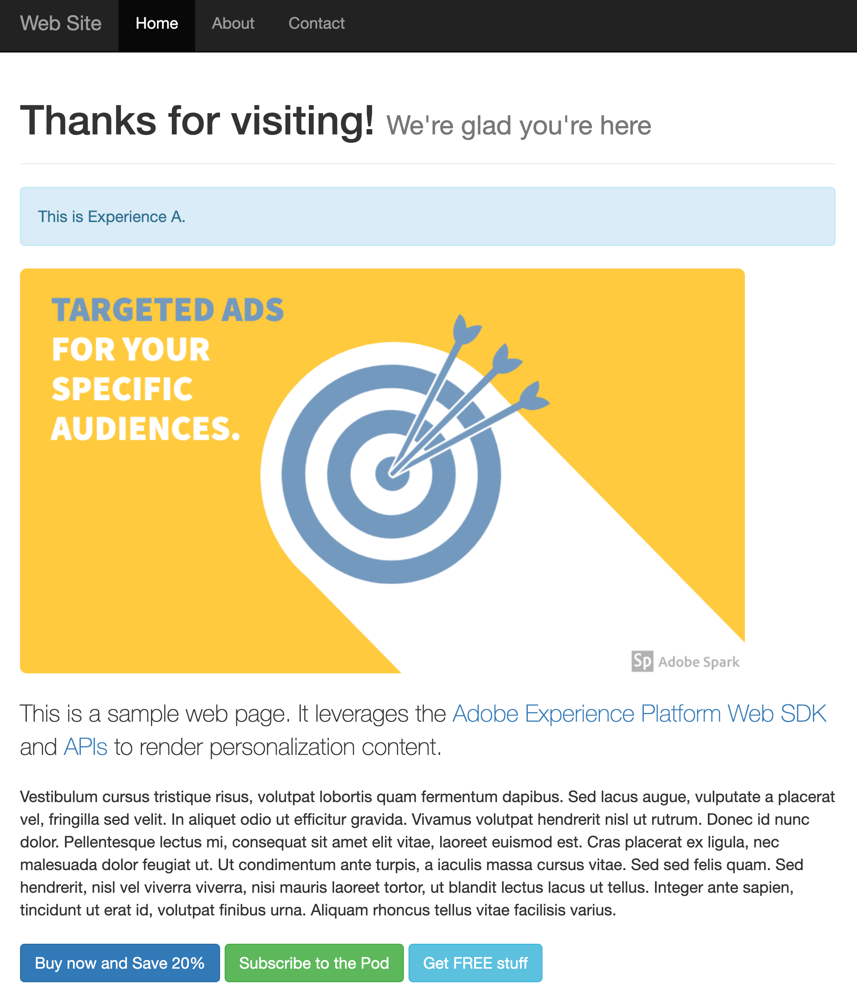

# Target Offers Client Side

## Overview

This sample demonstrates using Adobe Expreience Platform to get personalization offers from Target.  The web page changes based on the target offers returned.  

This sample uses the [Adobe Experience Platform Web SDK](https://experienceleague.adobe.com/docs/experience-platform/edge/home.html) to get target offers and to render them. 

Here is what the page looks like before and after personalization content is rendered. 

| without target personalization                              | with target personalization                                       |
|-------------------------------------------------------------|-------------------------------------------------------------------|
|  |  |

Please review the [summary of target activities used](../TargetActivities.md) for this sample. 

## Running the sample

## How it works

