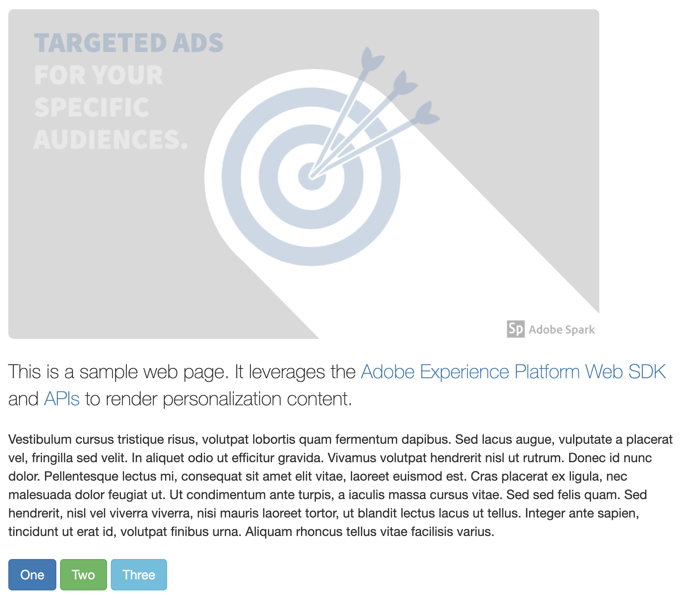

# Target Offers Client Side

## Overview

This sample demonstrates using Adobe Expreience Platform to get personalization offers from Target.  The web page changes based on the target offers returned.  

This sample uses the [Adobe Experience Platform Web SDK](https://experienceleague.adobe.com/docs/experience-platform/edge/home.html) to get target offers and to render them. 

Here is what the page looks like before and after personalization content is rendered. 

| without target personalization                              | with target personalization                                       |
|-------------------------------------------------------------|-------------------------------------------------------------------|
|  |  |

### Target Activities

There are two target activities that impact the page.

#### Activity 1

[//]: # (https://experience.adobe.com/#/@unifiedjslab/target/activities/activitydetails/A-B/aep-edge-samplesvecoffer)

This is an A/B test activity created using the Visual Experience Composer (VEC).  It has two experiences each one changing the header text and adding an alert beneath it.

| Experience                   | Visual treatment                                                       |
|------------------------------|------------------------------------------------------------------------|
| Experience A                 |  |
| Experience B                 |  |
| Default (no personalization) |  |

#### Activity 2
[//]: # (https://experience.adobe.com/#/@unifiedjslab/target/activities/activitydetails/A-B/aep-edge-samplessample-hero-image)
This is an A/B test activity created using the Form Based Composer.  It provides offers in the JSON format.  The client side implementation uses the JSON values to update the hero image and button text/actions on the page.

<table>
  <thead>
    <tr>
      <td>Experience</td>
      <td>JSON Offer</td>
      <td>Visual treatment</td>
    </tr>
  </thead>
  <tbody>
    <tr>
      <td>Experience A</td>
      <td>
        <pre>
{
  "heroImageName": "demo-marketing-offer1-exp-A.png",
  "buttonActions": [
    { "id": 1, "text": "Buy Now", "content": "Thanks for your purchase!" },
    { "id": 2, "text": "Subscribe", "content": "You are now subscribed!" },
    { "id": 3, "text": "Download", "content": "Downloading..." }
  ]
}
        </pre>
      </td>
      <td></td>
    </tr>    
    <tr>
      <td>Experience B</td>
      <td>
        <pre>
{
  "heroImageName": "demo-marketing-offer1-exp-B.png",
  "buttonActions": [
    { "id": 1, "text": "Buy now and Save 20%", "content": "Thank you for your purchase!" },
    { "id": 2, "text": "Subscribe to the Pod", "content": "Thank you for subscribing!" },
    { "id": 3, "text": "Get FREE stuff", "content": "Use coupon code THANKYOU at checkout." }
  ]
}
        </pre>
      </td>
      <td></td>
    </tr>    
    <tr>
      <td>Default (no personalization)</td>
      <td>N/A</td>
      <td></td>
    </tr>
  </tbody>
</table>

## Running the sample

## How it works

